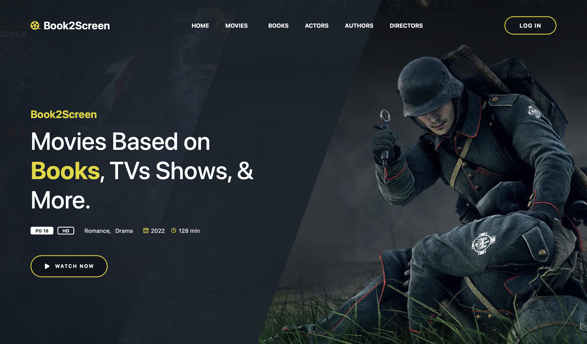
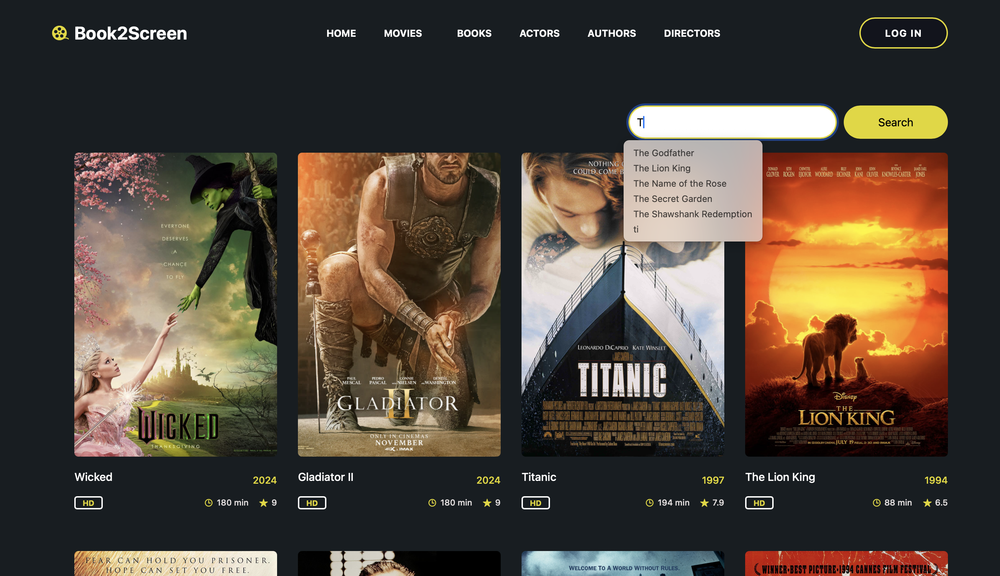
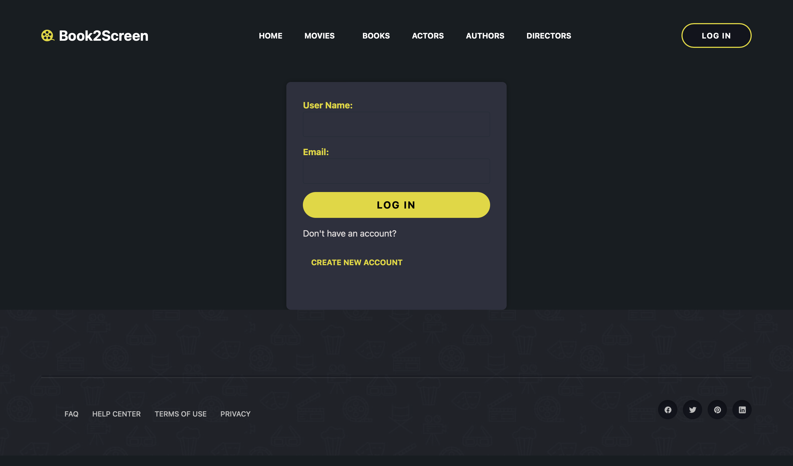
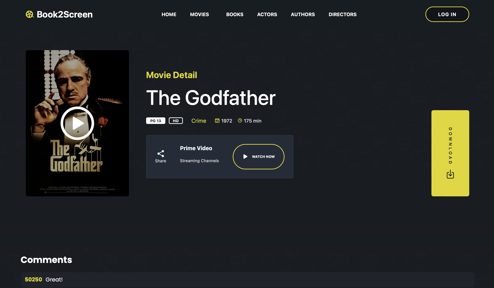
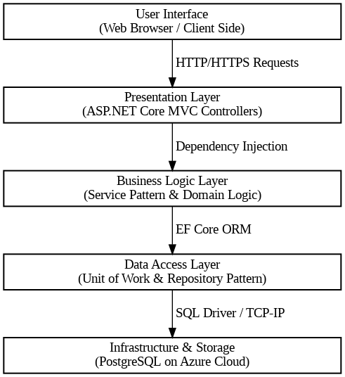
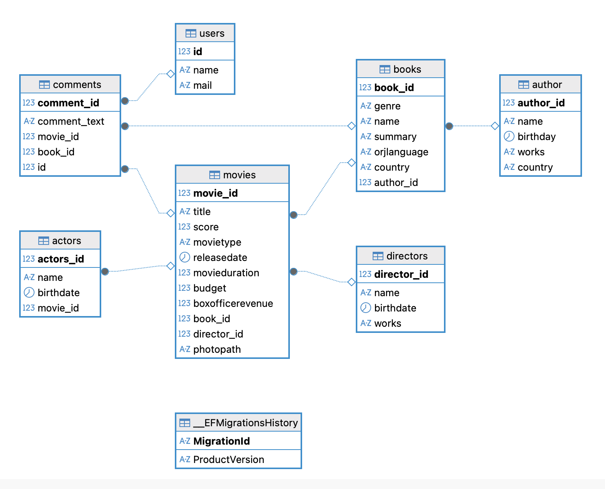

# Book2Screen 📚→🎬

A web-based platform for tracking and analyzing literary-to-cinematic adaptations. Built with ASP.NET Core 7.0, PostgreSQL, and deployed on Azure.

## ✨ Features

- **Relational Database**: Track book-movie adaptations with strict relationships
- **User Reviews**: Community-driven review and rating system  
- **Real-time Search**: Instant filtering of movies and books
- **Responsive UI**: Mobile-friendly design with dark mode
- **Secure Authentication**: User registration and login system

## 📸 Screenshots

| Landing Page | Movie Catalog |
|-------------|---------------|
|  |  |

| Authentication | Detail Page |
|----------------|-------------|
|  |  |

## 🏗️ Architecture



## 📊 Database Design

### Entity-Relationship Diagram


## 🛠️ Tech Stack

**Backend**: ASP.NET Core 7.0 MVC, Entity Framework Core 7.0, C#  
**Database**: PostgreSQL(managed via DBeaver), Azure Database  
**Frontend**: HTML5, CSS3, JavaScript, Bootstrap 5  
**Cloud**: Microsoft Azure App Service  
**Patterns**: Repository, Service, Unit of Work

## 🚀 Quick Start

### Prerequisites
- .NET 7.0 SDK
- PostgreSQL
- Visual Studio 2022 or VS Code

### Installation
```bash
# Clone repository
git clone https://github.com/yourusername/Book2Screen.git
cd Book2Screen
```

### Configuration
Update `appsettings.json` and `MovieDbContext.cs`:
```json
"ConnectionStrings": {
  "DefaultConnection": "Host=localhost;Database=Book2Screen;Username=postgres;Password=yourpassword"
}
```

```bash
# Apply migrations
dotnet ef database update

# Run application
dotnet run
```


## 📁 Project Structure

| Directory | Purpose |
|-----------|---------|
| **Controllers/** | ASP.NET MVC Controllers |
| **Models/** | Entity models and ViewModels |
| **Views/** | Razor views |
| **Services/** | Business logic services |
| **Repositories/** | Data access layer |
| **Context/** | DbContext and configurations |
| **UnitOfWorks/** | Unit of Work pattern |
| **wwwroot/** | Static files (CSS, JS, images) |

## 🌐 Deployment

### Azure Deployment
```bash
# Create Azure resources
az group create --name Book2Screen-RG --location eastus
az postgres server create --resource-group Book2Screen-RG --name book2screen-db
az webapp create --resource-group Book2Screen-RG --plan Book2Screen-Plan --name book2screen-app

# Configure connection string
az webapp config connection-string set --resource-group Book2Screen-RG --name book2screen-app --settings DefaultConnection="..." --connection-string-type PostgreSQL
```

### Local Development
```bash
# Development with hot reload
dotnet watch run

# Production build
dotnet publish -c Release
```


## 📞 Contact

| Field | Value |
|-------|-------|
| **Name** | Elif Kuş |
| **Email** | elifkuss.ek@gmail.com|
| **LinkedIn** | [elifkuss](https://www.linkedin.com/in/elifkuss) |
| **Project Repository** | [Book2Screen](https://github.com/elifkuss/Book2Screen) |
| **Live Demo** | [Azure Website](https://book2screen-hdhub4cfctbzb2cj.canadacentral-01.azurewebsites.net) |
